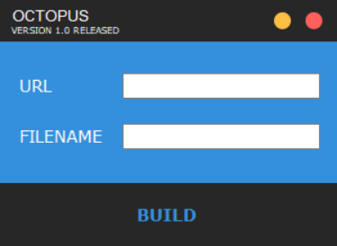

### Welcome to Octopus tool version 1.0

This tool will generate a persistent payload from any url. it's very simple to use.

### ❗ What is this ?

Octopus is a downloader tool that automate procedures during configuration of a persistent and make's your payload hidden in startup. It works with all file extensions. This tool was made for Windows users.

Video Proof: https://youtu.be/jn_W_rDgKjY

Scan Results: https://virusscan.jotti.org/en-US/filescanjob/0jlf7y2lfs

### ⚙️ FEATURES

- Hidden Stratup
- Compatible with Any File extension (.hta .bat .exe .mp4 etc)
- Easy to use & it doesn't need knowledge

### 📖 HOW TO INSTALL

1. Download the tool ('')
2. Unzip the file
3. Open the Octopus.exe file
4. Put the URL of your payload
5. Put any name for the file and press BUILD button.
6. Save it and Run it to see the magic

To learn more please watch this video: https://youtu.be/jn_W_rDgKjY

### 📡 HOW TO UPDATE

You can check updates from our official website:
https://ctoslab.com/products/

For feature recommendation please add it on the "Issues" tab or contact us:
https://www.ctoslab.com/support/

### 💰 Donate

If you like my work, consider buying me a coffee :)

Bitcoin > 12ZGhmVWi8QboVoExWjUFinyJpaKLqAmHN

⚠️ We are not responsible on how you use this tool. 
